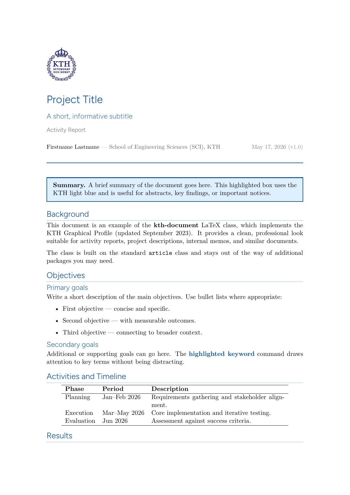
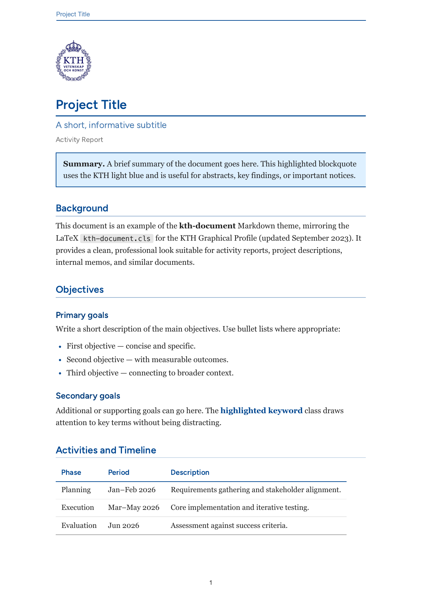

# kth-document — KTH Document Templates

Professional KTH document templates for **LaTeX**, **Markdown**, and
**reveal.js slide decks**, all implementing the
[KTH Graphical Profile](https://intra.kth.se/administration/kommunikation/varumarke/grafiskprofil)
(Grafisk manual v1.2, 2024). Use them for project descriptions, 
memos, slide decks, as a git submodule for package documentation, etc.

## Previews

| LaTeX (`example.tex` → lualatex) | Markdown (`example.md` → md-to-pdf) | Slides (`reveal/example.html`) |
|----------------------------------|--------------------------------------|--------------------------------|
|  |  | **[▶ Live deck][live]** |

[live]: https://cohm.github.io/kth-doc-templates/reveal/example.html

The LaTeX and Markdown previews above are regenerated automatically by
CI on every push to `main`, so they always reflect the current state of
the templates. The reveal deck is served live via GitHub Pages
([link][live]) — open it in your browser to interact with the
animations, transitions, and embedded widgets. PDFs from each CI run
(including a static print-pdf export of the deck) are available as
workflow artefacts.

## Files

| File | Purpose |
|------|---------|
| `kth-document.cls` | The LaTeX document class — copy this (and the logo) into your project |
| `md-to-pdf.{json,css}` | Markdown theme for [md-to-pdf](https://github.com/simonhaenisch/md-to-pdf) |
| `reveal/kth-reveal.css` | reveal.js theme — used by `reveal/example.html` |
| `reveal/example.html` | Annotated reveal.js example deck / starting point |
| `reveal/widgets/` | Drop-in interactive widgets embedded via `<iframe>` |
| `example.tex`, `example.md` | Fully annotated examples / starting points |
| `KTH_logo_RGB_bla.svg` | KTH logo (blue, vector) — for HTML and Markdown |
| `KTH_logo_RGB_bla.pdf` | KTH logo (blue, vector) — for LaTeX |
| `consumer-example/` | Recommended layout for using this repo as a git submodule |

## Quick start (LaTeX)

```latex
\documentclass[english, 11pt]{kth-document}

\title{My Document}
\subtitle{An optional subtitle}
\doctype{Activity Report}
\author{Firstname Lastname}
\affiliation{School of Engineering Sciences (SCI), KTH}
\date{\today}
\version{1.0}          % optional
\shorttitle{My Doc}    % shown in header on pages 2+

\begin{document}
\maketitle
...
\end{document}
```

Compiling with `pdflatex` works just fine, but if you use `lualatex`/`xelatex` you get the exact KTH fonts. The CI uses `lualatex` for the generated preview image.

## Quick start (Markdown)

[md-to-pdf](https://github.com/simonhaenisch/md-to-pdf) is an npm package
that wraps Puppeteer (headless Chromium). Install it once globally:

```bash
npm install -g md-to-pdf
```

The first install also downloads a Chromium build (~150 MB) for Puppeteer.
Then build a document:

```bash
md-to-pdf report.md \
  --config-file md-to-pdf.json \
  --document-title "My Document"
```

Place `` as the first line of your `.md` to use the
KTH logo as the title-block image. Use `<p class="subtitle">…</p>` and
`<p class="doctype">…</p>` for the metadata lines below the title, and
`<div class="notebox">…</div>` / `<span class="kthhl">…</span>` for the
sand-coloured note boxes and inline keyword highlights. Plain blockquotes
(`> …`) render as the light-blue summary boxes.

## Quick start (Slides)

`reveal/example.html` is a self-contained [reveal.js](https://revealjs.com)
deck with the KTH theme — open it directly in a browser:

```bash
open reveal/example.html       # macOS, double-click also works
```

reveal.js itself loads from a CDN, so there's nothing to install. To export
the deck as PDF, append `?print-pdf` to the URL and use the browser's "Save
as PDF" with paper size 1920×1080, no margins, and "Background graphics"
turned on (works well in Chrome under macos, use the system print dialog). 
CI does this automatically (see workflow artefacts).

The slide theme follows the official KTH PowerPoint master (per the
[kthpq](https://github.com/th-rtyf-re/kthpq) Beamer port): light-blue cover
with KTH logo top-centre and the wave-line *Linjemonster* corner motif,
white content slides with logo top-left and a sky-blue footer, sand-coloured
section dividers, and a KTH-blue closing slide. Figtree throughout. The
same custom-property names from `md-to-pdf.css` (`--kth-blue`, `--kth-navy`,
`--kth-sand`, …) are exposed in the slide theme so palette choices stay in
sync across the three template flows.

Set the deck-wide author and institute via attributes on the `.reveal`
wrapper — they appear in the footer of every content slide:

```html
<div class="reveal"
     data-kth-author="Firstname Lastname"
     data-kth-institute="School of Engineering Sciences (SCI), KTH">
```

Authoring cheatsheet:

- `<section data-state="cover">` — light-blue cover with logo top-centre
- `<section data-state="divider">` — sand divider with line motif
- `<section data-state="closing">` — KTH-blue end slide, white logo centred
- `<p class="section-name">…</p>` — sky-blue eyebrow above a slide title
- `<div class="palette">` / `.palette-fn` — animated swatch grids
- `<div class="cols-2">` — two-column layout
- `<iframe class="widget" data-src="widgets/foo.html">` — embed an
  interactive widget (Claude Design widget, custom web app, …); reveal
  pauses off-screen iframes to keep CPU cool

## Use as a git submodule

The recommended pattern for downstream packages is to add this repo as a
submodule under your `docs/` directory:

```bash
cd your-package
git submodule add https://github.com/kth/kth-doc-templates docs/.templates
cp docs/.templates/consumer-example/docs/Makefile docs/Makefile
```

Then write `docs/report.md` or `docs/report.tex` and run `make` from `docs/`.
The Makefile sets `TEXINPUTS=.:.templates:` for pdflatex (so
`\documentclass{kth-document}` resolves with no path prefix) and points
md-to-pdf at the submodule's config and stylesheet. See
[`consumer-example/`](consumer-example/) for the full layout.

## Class options

| Option | Effect |
|--------|--------|
| `english` | English locale — babel, standard decimal point *(default)* |
| `swedish` | Swedish locale — babel, decimal comma via `icomma` |
| `titlepage` | Full separate title page instead of inline title block |
| `10pt` / `11pt` / `12pt` | Base font size; heading sizes scale proportionally *(default: 11pt)* |
| *(any other)* | Passed through to the standard `article` class |

## Metadata commands

| Command | Description |
|---------|-------------|
| `\title{...}` | Document title *(required)* |
| `\subtitle{...}` | Subtitle shown below the title |
| `\doctype{...}` | Document type label, e.g. `Activity Report` |
| `\author{...}` | Author name(s) |
| `\affiliation{...}` | Department or school, shown next to the author |
| `\date{...}` | Date — use `\today` or a fixed string |
| `\version{...}` | Version string, rendered as `(vX.Y)` after the date |
| `\shorttitle{...}` | Short title shown in the header on pages 2 and beyond |

## Callout environments

```latex
\begin{kthbox}
  Light-blue box — use for summaries, key points, or notices.
\end{kthbox}

\begin{kthnotebox}
  Sand-coloured box — use for notes, caveats, or supplementary info.
\end{kthnotebox}
```

Inline: `\kthhl{keyword}` renders text in bold KTH blue.

## Colors

All colors from the KTH Grafisk manual are defined as named colors and can be
used anywhere with `\textcolor{name}{...}` or `\colorbox{name}{...}`.

**Primary palette**

| Name | Hex | Notes |
|------|-----|-------|
| `kthblue` | `#004791` | Brand blue — headings, rules, hyperlinks |
| `kthskyblue` | `#6298D2` | Sky blue |
| `kthnavy` | `#000061` | Navy — logo wreath color |
| `kthlightblue` | `#DEF0FF` | Light blue tint (`kthbox` background) |
| `kthsand` | `#EBE5E0` | Warm sand grey (`kthnotebox` background) |
| `kthwhite` | `#FFFFFF` | White |
| `kthdigitalblue` | `#0029ED` | Screen only — use `kthblue` for print |

**Functional palette** — for diagrams, charts, and reports.
Each family has three variants named `kth{dark,<empty>,light}{family}`:

| Family | Dark | Mid | Light |
|--------|------|-----|-------|
| `green` | `#0D4A21` | `#4DA060` | `#C7EBBA` |
| `teal` | `#1C434C` | `#339C9C` | `#B2E0E0` |
| `brick` | `#78001A` | `#E86A58` | `#FFCCC4` |
| `yellow` | `#A65900` | `#FFBE00` | `#FFF0B0` |
| `gray` | `#323232` | `#A5A5A5` | `#E6E6E6` |

Grey spellings (`kthgrey`, `kthdarkgrey`, `kthlightgrey`) are also accepted.
Aliases: `kthaccent` = `kthblue`, `kthmuted` = `kthsand`.

## Fonts

| Engine | Heading font | Body font |
|--------|-------------|-----------|
| `pdflatex` | TeX Gyre Heros (Helvetica clone) | TeX Gyre Pagella (Palatino clone) |
| `lualatex` | Figtree variable font *(if installed)*, else TeX Gyre Heros | Georgia *(if installed)* |
| `xelatex` | Figtree *(if installed)*, else TeX Gyre Heros | Georgia *(if installed)* |

Figtree is the official KTH heading font, available free from
[Google Fonts](https://fonts.google.com/specimen/Figtree) and the KTH Software Center.
Georgia is pre-installed on most systems. Both are optional — the class falls back
gracefully if they are not found.

## Logo

The logo is shown only on the first page (in the title block). The class looks
for the file named by `\kthlogopath` in order: `.pdf` → `.png` → `.eps`.

```latex
% Default — looks for KTH_logo_RGB_bla.{pdf,png,eps}
% Override with:
\renewcommand{\kthlogopath}{/path/to/your-logo}  % no extension
\renewcommand{\kthlogoheight}{1.8cm}              % adjust size
```

## Adding packages

The class loads: `geometry`, `xcolor`, `graphicx`, `hyperref`, `fancyhdr`,
`titlesec`, `parskip`, `mdframed`, `babel`, `csquotes`, `iftex`,
and `microtype` (pdfLaTeX only). All standard packages are safe to add in
the preamble as usual — `amsmath`, `booktabs`, `biblatex`, `siunitx`, `tikz`, etc.

## License

The class file is released under the
[MIT License](https://opensource.org/licenses/MIT).
The KTH logo and graphical profile are owned by KTH Royal Institute of Technology
and may only be used in accordance with the
[KTH Graphical Profile guidelines](https://intra.kth.se/administration/kommunikation/varumarke/grafiskprofil).
