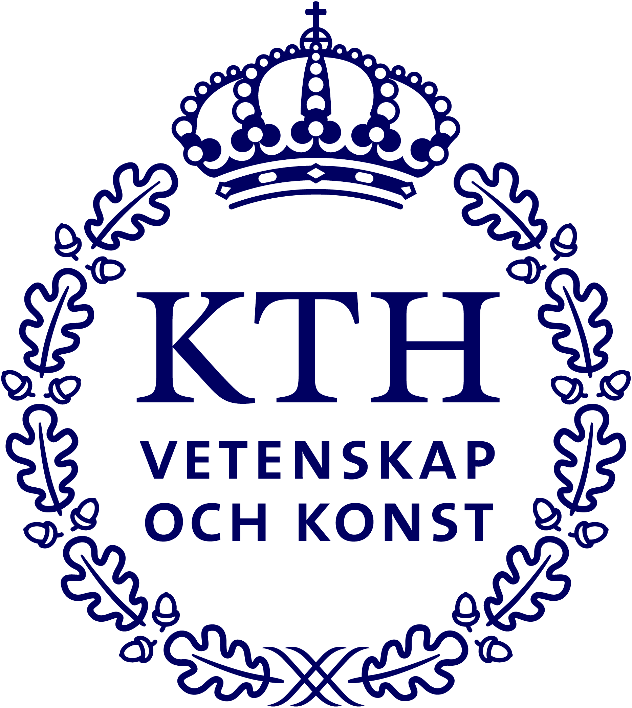

# Project Title

A short, informative subtitle

Activity Report

> **Summary.** A brief summary of the document goes here. This highlighted
> blockquote uses the KTH light blue and is useful for abstracts, key
> findings, or important notices.

## Background

This document is an example of the **kth-document** Markdown theme, mirroring
the LaTeX `kth-document.cls` for the KTH Graphical Profile (updated September
2023). It provides a clean, professional look suitable for activity reports,
project descriptions, internal memos, and similar documents.

## Objectives

### Primary goals

Write a short description of the main objectives. Use bullet lists where
appropriate:

- First objective — concise and specific.
- Second objective — with measurable outcomes.
- Third objective — connecting to broader context.

### Secondary goals

Additional or supporting goals can go here. The highlighted
keyword class draws attention to key terms without being distracting.

## Activities and Timeline

| Phase      | Period       | Description                                       |
|------------|--------------|---------------------------------------------------|
| Planning   | Jan–Feb 2026 | Requirements gathering and stakeholder alignment. |
| Execution  | Mar–May 2026 | Core implementation and iterative testing.        |
| Evaluation | Jun 2026     | Assessment against success criteria.              |

## Results

Describe outcomes, findings, or deliverables here.

**Note.** The sand-coloured `.notebox` div is useful for notes,
caveats, or supplementary information.

## Conclusions

Summarise key takeaways and any next steps or recommendations.

## Contact

For questions about this document, contact <name@kth.se>.
